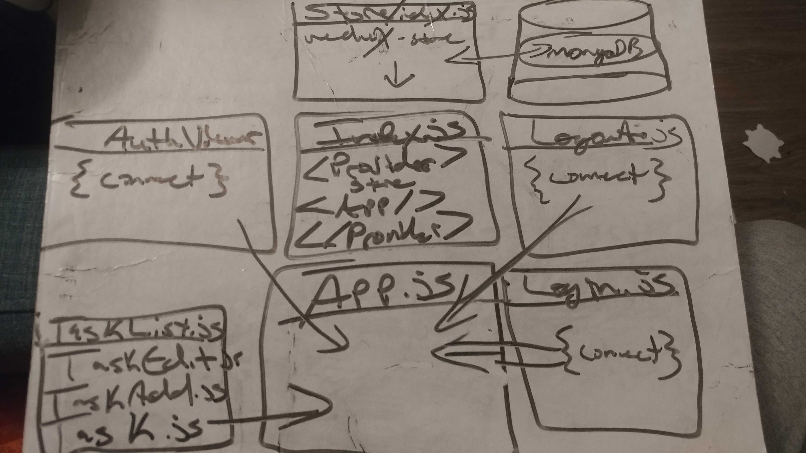

# LAB - 30 React Native ToDo Application

## Author: James Dunn

### Links and Resources

- [GitHub PR](https://github.com/james-401-advanced-javascript/lab-30/pull/1)

### Instructions

#### In order to run this app, you need to hit 'npm start' or 'expo start' from the command line after installing all necessary dependencies. Then, launch a simulator either on your computer or by scanning the application qr code with the Expo app from your phone. Once the screen loads, login with the username, "sarah@email.com" and the password of "sarahpassword" and you can begin adding, viewing, editing, and deleting tasks

### UML

